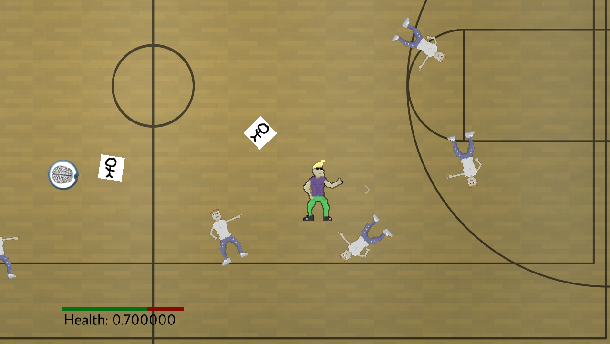

# Prom Hunk
#### Developed my Natalie Johanek, Austin Carlin, Matt Mozingo, and Jawad Ahmed

#### How to play:
Run `game.exe`. 
Move using WASD. 
Shoot by holding left click and aiming with your mouse pointer.
Select an upgrade from the shop by pressing 1, 2, or 3.

#### About

Prom Hunk is a 2D wave shooter. Our protagonist, Kyle Chad, is simply *too* attractive, and is being swarmed by hundreds of suitors. None of these suitors are worthy of his beauty. Fend off the nerds, band kids, and cheerleaders. Resist the Prom Queen's seduction - if you can.

### Sources used
1. A* Algorithm c++ implementation at geeksforgeeks.org, used by Jawad Ahmed
    source: https://www.geeksforgeeks.org/a-search-algorithm/
    used in: ObstacleManager.cpp, ObstacleManager.h and BasicRunnerEnemy.cpp (for pathfinding)
